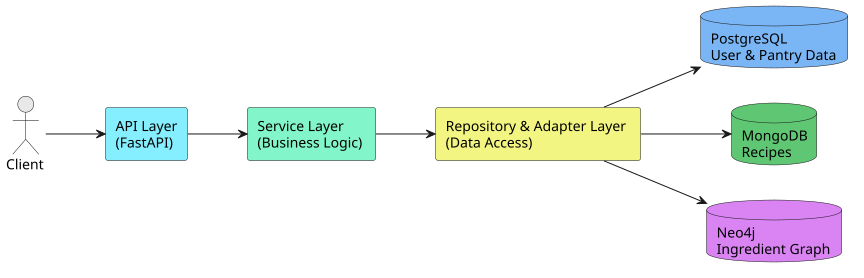

# SmartMeal 

[](https://martinfowler.com/bliki/PolyglotPersistence.html)
[](https://www.postgresql.org/)
[](https://www.mongodb.com/)
[](https://neo4j.com/)


SmartMeal is a backend system for intelligent meal planning that demonstrates how **polyglot persistence** can be used to solve real-world coordination problems across heterogeneous data sources.  
It integrates **PostgreSQL**, **MongoDB**, and **Neo4j** to support personalized meal planning, smart ingredient substitutions, pantry-aware shopping lists, and expiration-aware recommendations.

---

## Table of Contents
1. [Project Overview](#project-overview)
2. [Example: Pantry-Aware Weekly Meal Plan](#example-pantry-aware-weekly-meal-plan)
3. [Directory Organization](#directory-organization)
4. [Architecture](#architecture)
5. [Design Principles](#design-principles)
6. [Import Conventions](#import-conventions)
7. [Running Scripts](#running-scripts)
8. [Testing](#testing)
9. [Further Reading](#further-reading)

---
## Project Overview

Meal planning workflows are often fragmented across separate tools (recipes, grocery lists, and diet tracking). This forces users to manually reconcile information, increasing effort and contributing to avoidable food waste.

SmartMeal consolidates these workflows into one backend system and uses different database technologies for what they do best:

- **PostgreSQL** for transactional user, pantry, and inventory state  
- **MongoDB** for flexible recipe documents  
- **Neo4j** for ingredient substitution relationships and graph traversal

---

## Example: Pantry-Aware Weekly Meal Plan

This example illustrates how SmartMeal coordinates data across multiple databases to generate a weekly meal plan.

**Request**
```http
POST /plans
Content-Type: application/json

{
  "user_id": "234c1cd7-98ad-4a2a-bbcc-88df4e204138",
  "week_start": "2025-11-10",
  "days": 5,
  "use_substitutions": true
  
}
```
**Response**
```json
{
	"plan_id": "414c70ef-4b37-4f2a-8523-98d95587873f",
	"week_start": "2025-11-10",
	"days": 5,
	"message": "Weekly plan successfully generated."
}
```

## Directory Organization

```
SmartMeal/
│
├── app/                   # Core application configuration
│   ├── config.py          # Application settings (Pydantic)
│   ├── exceptions.py      # Custom exception classes
│   └── __init__.py        # Package exports
│
├── domain/                # Domain layer (models & schemas)
│   ├── models/            # SQLAlchemy models
│   │   ├── user.py
│   │   ├── pantry.py
│   │   ├── meal_plan.py
│   │   └── database.py    # DB initialization
│   └── schemas/           # Pydantic schemas
│       ├── profile_schemas.py
│       ├── waste_schemas.py
│       └── shopping_schemas.py
│
├── repositories/           # Data access layer
│   ├── base_repository.py
│   ├── user_repository.py
│   ├── pantry_repository.py
│   └── ...
│
├── services/               # Business logic layer
│   ├── profile_service.py
│   ├── pantry_service.py
│   ├── waste_service.py
│   ├── shopping_service.py
│   └── ...
│
├── adapters/              # External service adapters
│   ├── graph_adapter.py   # Neo4j adapter
│   ├── mongo_adapter.py   # MongoDB adapter
│   └── sql_adapter.py     # PostgreSQL adapter
│
├── api/                   # API layer
│   ├── routes/            # FastAPI route handlers
│   │   ├── users.py
│   │   ├── pantry.py
│   │   └── ...
│   └── middleware.py      # Custom middleware
│
├── scripts/               # CLI utilities & maintenance
│   ├── init_db.py         # Initialize all databases
│   ├── init_databases.py  # Database setup script
│   └── seed_neo4j.py      # Neo4j data seeding
│
├── data/                   # Data files & import scripts
│   ├── import_recipes.py
│   ├── substitution_pairs.json
│   └── ...
│
├── tests/                  # Test suite
│   ├── test_fixtures.py
│   ├── test_repositories.py
│   ├── test_services.py
│   └── ...
│
├── main.py                 # FastAPI application entry point
├── docker-compose.yml      # Docker orchestration
├── Dockerfile              # Container definition
├── requirements.txt        # Python dependencies
└── README.md               # Project documentation
```

## Architecture

SmartMeal follows a layered backend design (API → Services → Domain → Repositories/Adapters) and orchestrates three databases behind a unified API.

- **PostgreSQL**: user profiles, pantry inventory, waste logs 
- **MongoDB**: recipes as hierarchical JSON-like documents 
- **Neo4j**: substitutions and ingredient relationship graph 

 

### 1. **App Layer** (`app/`)

Foundation of the application:

- **Configuration**: Environment-based settings
- **Exceptions**: Domain-specific error classes
- **Why "app"?**: Industry standard for application-level code

### 2. **Domain Layer** (`domain/`)

Core business entities:

- **Models**: Database table definitions (SQLAlchemy)
- **Schemas**: Request/response validation (Pydantic)
- **Independence**: No external dependencies

### 3. **Repository Layer** (`repositories/`)

Data access abstraction:

- **CRUD operations**: Database interactions
- **Query logic**: Complex data retrieval
- **Database agnostic**: Easy to swap implementations

### 4. **Service Layer** (`services/`)

Business logic orchestration:

- **Use cases**: Application workflows
- **Validation**: Business rules enforcement
- **Coordination**: Multiple repositories & adapters

### 5. **Adapter Layer** (`adapters/`)

External service integration:

- **Neo4j**: Graph database for ingredients
- **MongoDB**: Document store for recipes
- **SQL**: Relational data via SQLAlchemy

### 6. **API Layer** (`api/`)

HTTP interface:

- **Routes**: Endpoint definitions
- **Middleware**: Request/response processing
- **Validation**: Input sanitization

### 7. **Scripts** (`scripts/`)

Maintenance & utilities:

- **Database setup**: Schema creation & seeding
- **Data migration**: Import/export scripts
- **CLI tools**: Administrative commands

## Design Principles

### Clean Architecture

- **Dependency Rule**: Inner layers don't depend on outer layers
- **Domain-Centric**: Business logic is independent
- **Testable**: Each layer can be tested in isolation

### Separation of Concerns

- **Models**: What data looks like
- **Repositories**: How to access data
- **Services**: What to do with data
- **API**: How to expose functionality

### Why This Structure?

####  **app/** (not "core")

- Standard Python convention
- Clear purpose: application configuration
- Separate from business logic

#### **scripts/** (not for everything)

- Only executable CLI scripts
- One-off utilities
- Maintenance tasks


## Import Conventions

```python
# Application configuration & exceptions
from app.config import settings
from app.exceptions import ServiceValidationError, NotFoundError

# Domain models
from domain.models import AppUser, PantryItem
from domain.schemas.profile_schemas import ProfileUpdateRequest

# Repositories
from repositories import UserRepository, PantryRepository

# Services
from services.pantry_service import PantryService

# Adapters
import adapters.graph_adapter as graph_adapter
```

## Running Scripts

```powershell
# Initialize databases
python scripts/init_db.py

# Seed Neo4j
python scripts/seed_neo4j.py --file data/substitution_pairs.json

# Import recipes
python data/import_recipes.py

# Seed PostgreSQL
python scripts/seed_postgres.py     
```

## Testing

Tests mirror the source structure:

- `test_repositories.py` → `repositories/`
- `test_services.py` → `services/`
- `test_error_handling.py` → Edge cases

## Further Reading

- [Clean Architecture by Robert C. Martin](https://blog.cleancoder.com/uncle-bob/2012/08/13/the-clean-architecture.html)
- [Domain-Driven Design](https://martinfowler.com/bliki/DomainDrivenDesign.html)
- [FastAPI Best Practices](https://fastapi.tiangolo.com/tutorial/)
